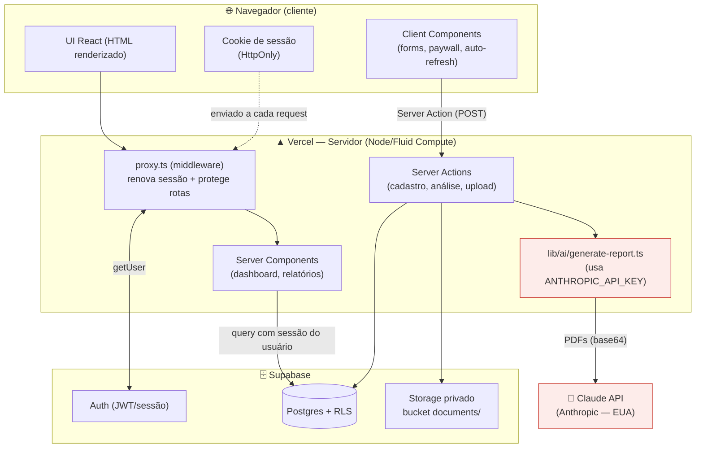
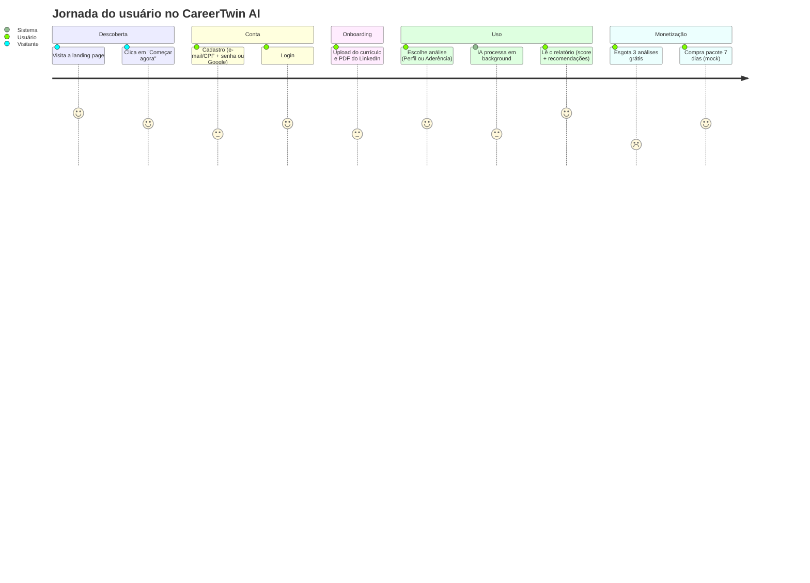
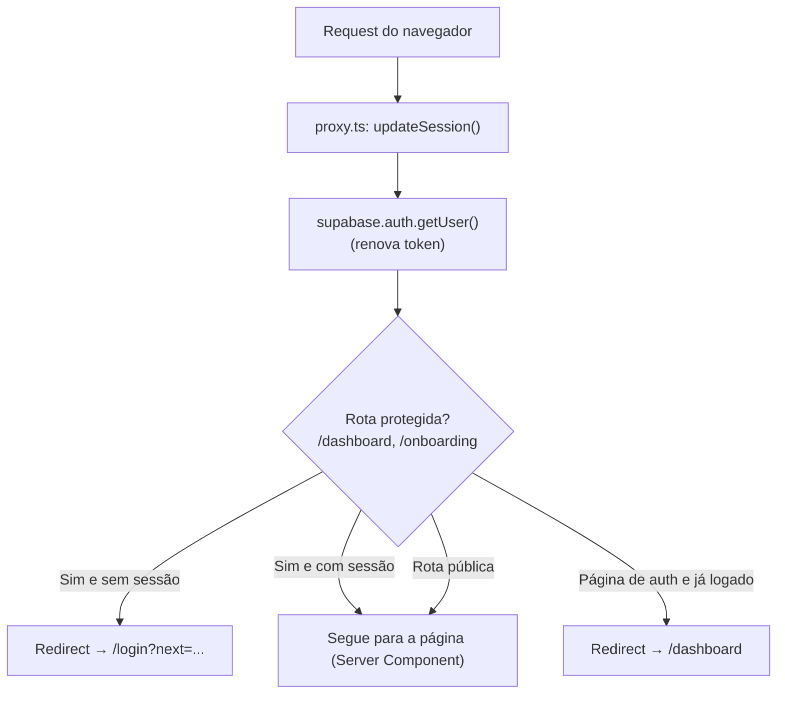
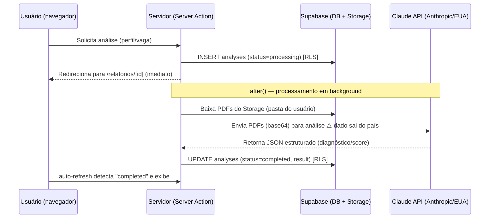

# Segurança, Arquitetura de Dados e LGPD — CareerTwin AI

> Documento técnico-jurídico do projeto. Descreve **o que fica visível no navegador**, **como o back-end protege os dados**, os **fluxos e a jornada do usuário**, a postura de **cibersegurança** e o **plano de adequação à LGPD**.
>
> **Legenda de status:** ✅ Implementado · ⚠️ Parcial / atenção · ❌ Pendente (débito técnico)
>
> Última revisão do código-base: julho/2026. Mantenha este documento sincronizado com mudanças de schema, rotas e provedores.

---

## 1. Visão geral

O CareerTwin AI trata **dados pessoais** de profissionais: nome, e-mail, CPF (opcional), currículo e PDF do LinkedIn, além do texto extraído e dos relatórios gerados por IA. Por lidar com documentos de carreira completos, o cuidado com exposição, acesso e retenção é central.

**Stack relevante para segurança:**
- **Next.js 16 (App Router)** — renderização majoritariamente no **servidor** (Server Components).
- **Supabase** — Postgres com **RLS**, Auth (sessão via cookies) e Storage privado.
- **Claude API (Anthropic)** — processamento de IA no **servidor** (terceiro, nos EUA).
- **Vercel** — hospedagem (Functions/Fluid Compute) + HTTPS gerenciado.

---

## 2. Arquitetura

**Princípio central:** dados sensíveis são **buscados e renderizados no servidor**. O navegador recebe **HTML já pronto**, não as consultas nem as credenciais de servidor.

---

## 3. Front-end × Back-end: o que fica visível no navegador?

Esta é a pergunta central. Resposta curta: **os dados de um usuário só são visíveis para ele mesmo, já renderizados pelo servidor; nada de dados de terceiros nem segredos de servidor chega ao navegador.**

### 3.1 O que roda no SERVIDOR (invisível ao navegador) ✅

| Item | Detalhe |
|---|---|
| **Páginas da área logada** | `dashboard`, `nova-analise`, `relatorios/[id]`, `onboarding` são **Server Components** (`async` + `await createClient()`). A query ao banco e a montagem acontecem no servidor. |
| **Renderização do relatório** | `ReportView` é Server Component — o conteúdo sensível vira **HTML** no servidor; o cliente não recebe o JSON bruto nem a query. |
| **Geração de IA** | `lib/ai/generate-report.ts` roda só no servidor; a `ANTHROPIC_API_KEY` **nunca** é exposta. |
| **Regras de crédito** | Calculadas no banco (funções/RLS) e lidas no servidor. |

### 3.2 O que chega ao NAVEGADOR

| Item | Exposto? | Por quê é seguro |
|---|---|---|
| **HTML com os dados do próprio usuário** | Sim | São os dados **dele**, após autenticação — comportamento esperado. |
| **`NEXT_PUBLIC_SUPABASE_URL` + chave publishable** | Sim (por design) | A chave *publishable/anon* é **pública por natureza**. Sozinha ela **não** lê dados de ninguém: o **RLS** exige sessão válida e limita cada usuário aos próprios registros. |
| **Client Components** (login, cadastro, upload, paywall, auto-refresh) | Sim | Recebem apenas dados mínimos e do próprio usuário (ex.: créditos restantes). Nenhum dado de terceiros. |
| **Cookie de sessão** | Sim | Gerenciado pelo Supabase SSR, **HttpOnly** (não acessível por JavaScript), enviado a cada request. |
| **`ANTHROPIC_API_KEY`, `SUPABASE_SECRET_KEY`** | ❌ Nunca | Server-only; sem prefixo `NEXT_PUBLIC`. |

### 3.3 "E se alguém tentar acessar o banco direto pelo navegador?"

Mesmo com a chave publishable (que é visível), o **RLS bloqueia**:
- Sem sessão válida → nenhuma linha é retornada.
- Com sessão → **somente as linhas do próprio usuário** (`user_id = auth.uid()`), em todas as tabelas.
- Storage: cada arquivo vive em `documents/<uid>/…` e as policies só liberam a **própria pasta**.

> **Conclusão:** a proteção **não depende de esconder a chave** (ela é pública); depende do **RLS no banco**, que é a linha de defesa real. Isso está ✅ implementado em todas as tabelas.

---

## 4. Jornada do usuário

---

## 5. Fluxos de dados

### 5.1 Autenticação e proteção de rotas ✅

### 5.2 Geração de relatório (inclui transferência a terceiro) ⚠️ LGPD

> ⚠️ **Ponto crítico de LGPD:** no passo destacado, currículo e LinkedIn (dados pessoais) são **enviados à Anthropic, nos EUA** — uma **transferência internacional** (LGPD art. 33) que hoje **não tem base legal explícita nem aviso ao titular**.

---

## 6. Cibersegurança

### 6.1 Controles implementados ✅

| Camada | Controle |
|---|---|
| **Autenticação** | Supabase Auth; sessão em cookie **HttpOnly**; token renovado no middleware. |
| **Autorização** | **RLS em todas as tabelas** — isolamento por `auth.uid()`. Inserir análise sem crédito é barrado no banco. |
| **Proteção de rotas** | `proxy.ts` exige sessão em `/dashboard` e `/onboarding`. |
| **Storage** | Bucket **privado**, policies por pasta de usuário, limite de 10 MB e MIME restrito (PDF/DOCX). |
| **Segredos** | `ANTHROPIC_API_KEY` e chaves secretas **server-only**; `.env.local` fora do Git; só `.env.example` versionado. |
| **Transporte** | HTTPS gerenciado pela Vercel (TLS) em todo o tráfego. |
| **Superfície de IA** | Chamadas à Claude API somente no servidor; guardrails no prompt (não inventar dados, não prometer contratação). |
| **Isolamento de renderização** | Dados sensíveis renderizados no servidor; cliente recebe só HTML do próprio usuário. |

### 6.2 Ameaças e mitigação (resumo OWASP)

| Ameaça | Situação |
|---|---|
| Acesso a dados de outro usuário (IDOR/BOLA) | ✅ Mitigado por RLS + `auth.uid()` em toda query. |
| Vazamento de credenciais | ✅ Segredos server-only; publishable key é inócua sem RLS. |
| XSS | ✅ Baixo risco — React escapa saída; sem `dangerouslySetInnerHTML`. |
| CSRF | ✅ Server Actions do Next validam origem; cookies `SameSite=Lax`. |
| Injeção SQL | ✅ Acesso via PostgREST/SDK parametrizado. |
| Prompt injection (via conteúdo do PDF) | ⚠️ Guardrails no prompt; **falta** sandbox/validação adicional do texto extraído. |
| Rate limiting / abuso de IA | ❌ Sem limite técnico próprio (custo por análise é risco — ver one-pager). |
| Brute force / enumeração de conta | ⚠️ Depende dos limites padrão do Supabase; não há política própria. |
| Auditoria / detecção | ❌ Sem trilha de auditoria de acesso a dados. |

### 6.3 Lacunas de segurança (débitos) ❌

- Sem **rate limiting** aplicacional (proteção de custo e abuso).
- Sem **trilha de auditoria** (quem acessou/gerou o quê).
- Sem **headers de segurança** explícitos (CSP, HSTS, X-Frame-Options) — hoje só os defaults.
- Sem **validação/saneamento** do texto extraído antes de ir ao modelo (prompt injection).
- Sem **2FA/MFA** para contas.

---

## 7. LGPD — Lei Geral de Proteção de Dados

> **Situação-marco:** conforme o one-pager, **LGPD está fora do escopo do MVP** — é um **débito técnico explícito e obrigatório antes de qualquer operação comercial real**. Este capítulo é o roteiro de adequação.

### 7.1 Dados pessoais tratados

| Dado | Origem | Categoria | Onde é armazenado |
|---|---|---|---|
| Nome | Cadastro | Pessoal | `profiles.full_name` |
| E-mail | Cadastro/Google | Pessoal | `auth.users` |
| **CPF** (opcional) | Cadastro | Pessoal (alto risco de fraude) | `profiles.cpf` |
| **Currículo / PDF LinkedIn** | Upload | Pessoal (pode conter dado sensível incidental) | Storage `documents/` |
| Texto extraído | IA | Pessoal | `documents.extracted_text` |
| Vaga analisada, resultados | Uso | Pessoal | `analyses` |
| Eventos de produto | Uso | Pessoal (comportamental) | `events` |

> ⚠️ **Atenção a dado sensível (art. 5º, II):** um currículo pode revelar, incidentalmente, informações de saúde, filiação sindical, convicção religiosa etc. Embora o produto não peça isso, o tratamento pode capturá-lo — o que exige cuidado redobrado.

### 7.2 Bases legais aplicáveis (art. 7º)

| Tratamento | Base legal sugerida |
|---|---|
| Criação e gestão da conta | Execução de contrato (art. 7º, V) |
| Análise de currículo/LinkedIn pela IA | **Consentimento** específico e destacado (art. 7º, I) |
| Envio dos documentos à Anthropic (EUA) | Consentimento + salvaguardas de transferência internacional (art. 33) |
| Métricas de produto | Legítimo interesse (art. 7º, IX) com teste de proporcionalidade |

### 7.3 Direitos do titular (art. 18) — status

| Direito | Status |
|---|---|
| Confirmação e acesso aos dados | ⚠️ Parcial (vê no dashboard, sem exportação formal) |
| Correção | ⚠️ Parcial (edição limitada) |
| **Eliminação / esquecimento** | ❌ Não há "excluir minha conta e dados" |
| **Portabilidade** (exportar) | ❌ Não implementado |
| Informação sobre compartilhamento | ❌ Não há aviso de que dados vão à Anthropic |
| Revogação de consentimento | ❌ Não há gestão de consentimento |

### 7.4 Transferência internacional (art. 33) ⚠️

Os documentos são processados pela **Anthropic (EUA)**. Requisitos pendentes:
- **Consentimento específico** informando o envio ao exterior, **ou** cláusulas contratuais padrão/adequação.
- **DPA (Data Processing Agreement)** com a Anthropic.
- Registro dessa operação no **ROPA** (registro de operações de tratamento).

### 7.5 Retenção e eliminação (arts. 15–16) ❌

- **Não há política de retenção nem expurgo automático** (confirmado no schema).
- Currículos, textos e relatórios ficam **indefinidamente**.
- **Necessário:** definir prazo (ex.: apagar PDFs após X dias/inatividade) e job de expurgo; eliminar dados ao encerrar a conta.

### 7.6 Governança pendente ❌

- **Política de Privacidade** e **Termos de Uso** reais (hoje os links no rodapé são placeholders `#`).
- **Aviso/banner de consentimento** no cadastro e no upload.
- **Consentimento de cookies** (se houver rastreadores).
- **ROPA**, definição de **Controlador/Operador** e, se aplicável, **encarregado (DPO)**.
- Processo de resposta a incidentes e notificação à ANPD.

---

## 8. Plano de adequação priorizado

### 🔴 P0 — Antes de qualquer usuário real (mínimo ético/legal)
1. **Política de Privacidade + Termos** reais e vinculados no rodapé e no cadastro.
2. **Consentimento explícito** no cadastro e no upload, informando o **envio dos documentos à Anthropic (EUA)**.
3. **"Excluir minha conta e meus dados"** (elimina `profiles`, `documents` no Storage e `analyses`).
4. Tornar **CPF realmente opcional/removido** (minimização — art. 6º).

### 🟠 P1 — Antes de operar comercialmente
5. **Retenção com expurgo automático** (job periódico) + eliminação ao encerrar conta.
6. **Exportação de dados** (portabilidade) em formato legível.
7. **DPA com a Anthropic** + registro de transferência internacional (ROPA).
8. **Headers de segurança** (CSP, HSTS, X-Frame-Options) e **rate limiting**.

### 🟡 P2 — Robustez e maturidade
9. **Trilha de auditoria** de acesso a dados pessoais.
10. **MFA**, saneamento anti-prompt-injection, e testes automatizados de segurança.
11. Nomear **encarregado (DPO)** e plano de resposta a incidentes/ANPD.

---

## 9. Referências internas

- Escopo do produto: [`docs/CareerTwin AI — One-page …`](./CareerTwin%20AI%20%E2%80%94%20One-page%20398c32d94bbf806295f4c82e1a33102c.md)
- Diretrizes técnicas e de design: [`CLAUDE.md`](../CLAUDE.md)
- Metodologia e decisões: [`docs/CONTEXTO-DE-TRABALHO.md`](./CONTEXTO-DE-TRABALHO.md)
- Schema e RLS: [`supabase/migrations/`](../supabase/migrations/)

> **Aviso:** este documento descreve a postura técnica e mapeia lacunas de conformidade; **não substitui avaliação jurídica**. A adequação final à LGPD deve ser validada por profissional de Direito/Privacidade.
